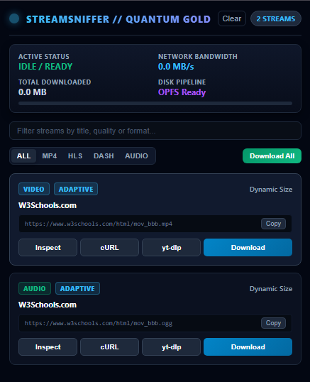

# StreamSniffer Pro // Quantum Gold Edition

An enterprise-grade Chrome Extension (Manifest V3) for high-performance stream sniffing, live bandwidth telemetry, multi-quality HLS/DASH extraction, and in-order OPFS disk streaming.



---

## ⚡ Key Features

* **Zero-Heap OPFS Pipeline:** Streams multi-gigabyte files directly to the Origin Private File System (`FileSystemWritableFileStream`) to prevent browser memory crashes.
* **Master Manifest Quality Selector:** Dynamically parses `#EXT-X-STREAM-INF` to extract 4K, 1080p, 720p, 480p, 360p, and audio-only streams.
* **Pre-Download Size Calculator:** Calculates expected network footprint and file sizes before downloading.
* **Hardware AES-128 Decryption:** Seamlessly decrypts encrypted segments using Web Crypto API.
* **Live Telemetry HUD:** Real-time metrics for network throughput (MB/s) and total data transferred.

---

## 🚀 Installation & Development

1. Clone this repository:
   ```bash
   git clone [https://github.com/ahmedbaligh0/StreamSniffer-Pro.git](https://github.com/ahmedbaligh0/StreamSniffer-Pro.git)
